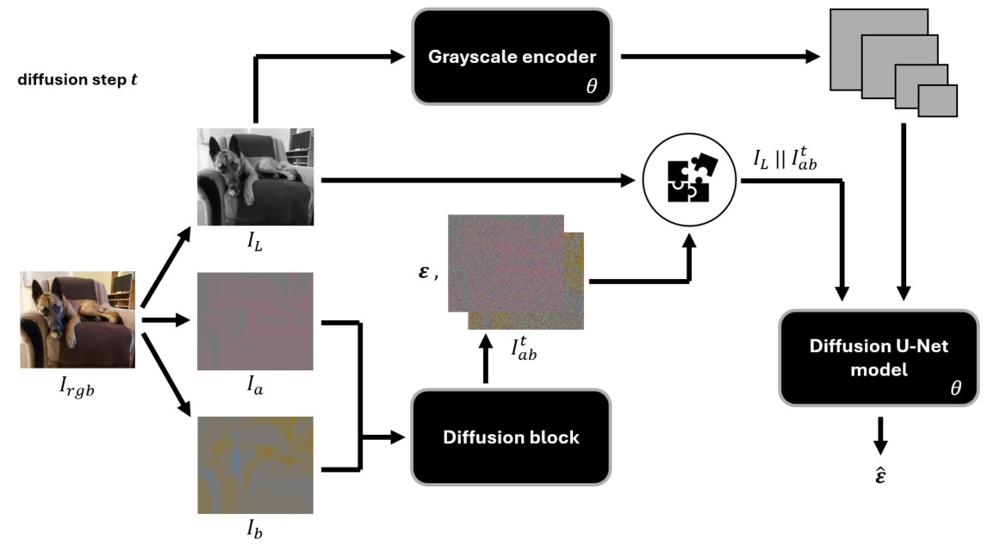

<!-- README template: https://github.com/othneildrew/Best-README-Template -->
<a id="readme-top"></a>

<!-- PROJECT LOGO -->
<br />
<div align="center">
  <a href="https://github.com/myrepo">
    
  </a>
  <h3 align="center">Deep Learning Image Colorizer</h3>
</div>

<!-- TABLE OF CONTENTS -->
<details>
  <summary>Table of Contents</summary>
  <ol>
    <li>
      <a href="#about-the-project">About The Project</a>
    </li>
    <li>
      <a href="#getting-started">Getting Started</a>
      <ul>
        <li><a href="#installation">Installation</a></li>
      </ul>
    </li>
    <li><a href="#about-the-models">About the Models — Architectures & Training</a></li>
    <ul>
        <li>
        <a href="#model1">Model 1: Convolutional Model</a>
        <ul>
            <li><a href="#model1-architecture-overview">Architecture Overview</a></li>
            <li><a href="#model1-training-optimization">Training & Optimization</a></li>
        </ul>
        </li>
        <li>
        <a href="#model2">Model 2: GAN Model</a>
        <ul>
            <li><a href="#model2-architecture-overview">Architecture Overview</a></li>
            <li><a href="#model2-training-optimization">Training & Optimization</a></li>
        </ul>
        </li>
        <li>
        <a href="#model3">Model 3: Diffusion-based Model</a>
        <ul>
            <li><a href="#model3-architecture-overview">Architecture Overview</a></li>
            <li><a href="#model3-training-optimization">Training & Optimization</a></li>
        </ul>
        </li>
        <li>
        <a href="#model4">Model 4: Transformer-based Model</a>
        <ul>
            <li><a href="#model4-architecture-overview">Architecture Overview</a></li>
            <li><a href="#model4-training-optimization">Training & Optimization</a></li>
        </ul>  
        </li>
    </ul>
    <li><a href="#literature">Literature</a></li>
  </ol>
</details>

---

<!-- ABOUT THE PROJECT -->
<a id="about-the-project"></a>
## 🎨 About The Project

This project contains the source code of my master’s thesis, which describes and implements four automatic image colorization methods for grayscale images based on modern deep learning architectures — a multi-path convolutional neural network, a generative adversarial network (GAN), a diffusion model, and a transformer-based model. The models were trained and evaluated on the ImageNet dataset and further tested on historical black-and-white photographs to assess their applicability in real-world scenarios.

**Try the Models**
- You can try out the models yourself using the Streamlit app available in the [GitHub repo](https://github.com/ivansetka/image-colorizer-streamlit)!

<p align="right">(<a href="#readme-top">back to top</a>)</p>


<!-- GETTING STARTED -->
<a id="getting-started"></a>
## 🚀 Getting Started

_If you want to run the project, follow the setup instructions below_ ⬇️

<a id="installation"></a>
### 📦 Installation

1. Clone the repository:
   ```sh
   git clone https://github.com/ivansetka/image-colorizer.git
   cd image-colorizer
   ```
2. Create and activate a virtual environment:
  - On Windows
    ```sh
    python -m venv env
    env\Scripts\activate
    ```
  - On macOS/Linux
    ```sh
    python3 -m venv env
    source env/bin/activate
    ```
3. Install all required dependencies:
   ```sh
   pip install -r requirements.txt
   ```

- You can now further experiment by training the models yourself using the available checkpoints at the following [link](https://drive.google.com/drive/folders/15jhq8XAJIOH112ZJeRDMxTGQAg6f3ooE?usp=sharing) — 
just make sure you have the ImageNet dataset downloaded locally or try using a different dataset instead.

<p align="right">(<a href="#readme-top">back to top</a>)</p>


<!-- About the Models -->
<a id="about-the-models"></a>
## About the Models — Architectures & Training

This section presents four deep learning architectures developed for the task of grayscale image colorization, along with the training procedures and hyperparameters used. The models were trained on a subset of the ImageNet ILSVRC 2012 dataset and evaluated both on that dataset and on historical black-and-white photos.  
  
<a id="model1"></a>
### 🧠 Model 1: Convolutional Model
This model implementation is based on the work presented in [^1].  
  
<a id="model1-architecture-overview"></a>
#### 🏗️ Architecture Overview  
  
  
  
The model architecture consists of five main components: a low-level features network (with two branches), a mid-level features network, a global features network, a colorization network, and a classification network. All components are composed of convolutional blocks that include convolution, activation (ReLU), and batch normalization.  
  
The grayscale input image of shape `H x W x 1` is first passed through the upper branch of the low-level features network. This part gradually reduces spatial resolution using convolutional layers, enabling better generalization and reduced parameter count — a common approach in modern deep learning models for vision tasks. Simultaneously, a resized copy of the grayscale image (scaled to `224x224`) is processed in the lower branch and passed into the global features network. Although there are two branches in the local network, they share the same weights, allowing input images of arbitrary resolution.  
  
The global network includes fully connected layers that produce compact feature vectors. These vectors are used in two ways:  
- One is fused with mid-level features in a fusion layer before final colorization.  
- The other is passed to a classification network, which is only active during training if class labels are available.  
  
The fused features are passed into the colorization network, which progressively upsamples them using nearest-neighbor interpolation and convolutional layers. The output consists of the two chrominance channels `ab`, which are then combined with the original grayscale `L` channel to reconstruct a full-color image in `Lab` color space, shaped `H x W x 3`.  
  
<a id="model1-training-optimization"></a>
#### ⚙️ Training & Optimization  
  
Training was performed on `40%` of the available training data using the following augmentations:  
- Resizing to `256x256`,
- Random cropping to `224x224`,  
- Random horizontal flipping (`50%` chance).  
  
The model uses the Lab color space and minimizes the mean squared error (MSE) between the predicted and ground-truth `ab` color channels. Additionally, a cross-entropy loss is applied for classification, which helps provide global context and improves color quality.  
  
The total loss function is:

<div align="center">

</div>

where `α` is set to `1/300`, following the original paper.  
Key training hyperparameters:  
- Optimizer: `ADADELTA`,
- Initial learning rate: `1e-5`,  
- Batch size: `64`,
- Epochs: `20`.
  
Every `5 epochs`, a new random subset of the training set is selected to increase robustness and reduce overfitting. This approach was chosen heuristically to balance performance with hardware constraints. Each epoch takes approximately `58 minutes` to complete.  

<p align="right">(<a href="#readme-top">back to top</a>)</p>


<a id="model2"></a>
### 🧠 Model 2: GAN Model
This model implementation is inspired by the approaches presented in [^2], [^3], [^4], and [^5].

<a id="model2-architecture-overview"></a>
#### 🏗️ Architecture Overview

 

In its first version, the model uses a U-Net-based generator and a patch-based discriminator (PatchGAN). The U-Net generator follows an encoder-decoder structure with a bottleneck that acts as an information filter. The encoder consists of blocks with convolutional layers (`kernel size 4, stride 2`), batch normalization, and leaky ReLU activations. The number of channels doubles after each layer. The decoder mirrors this structure, using transposed convolutions (also `kernel size 4, stride 2`), concatenation with corresponding encoder features (skip connections), group normalization, and ReLU activations. The final layer uses a `1x1` convolution to compress the output to the desired number of color channels.

The patch discriminator resembles the encoder part of the generator. It also uses convolutional blocks (`kernel size 4, stride 2`), batch normalization, and leaky ReLU activations, with the number of channels doubling after each layer. The output is a single feature map (via a `1x1 convolution`), with spatial dimensions `M x M`. Each of the `M²` outputs corresponds to a receptive field of size `N x N` in the input image. For example, with a `256x256` input image, the final feature map has size `M = 30` and a receptive field of `N = 70`.

In the second version of the model, the encoder path of the generator is replaced with a pre-trained ResNet-18, leveraging weights learned on ImageNet for image classification and recognition. A symmetrical decoder path is constructed to recreate the U-Net architecture, connecting via a bottleneck and skip connections to intermediate encoder features. Thanks to the pre-trained network, the generator can learn more semantically rich features, potentially improving training speed and output quality.

<a id="model2-training-optimization"></a>
#### ⚙️ Training & Optimization

The first model variant was found to converge slowly in early epochs. To address this, the second version using a ResNet-18 encoder was used instead. Training is done in two phases: (1) pretraining the generator, and (2) training the full conditional GAN (cGAN) consisting of both the generator and the patch discriminator.

**Phase 1: Generator Pretraining**

In the pretraining phase, `5%` of the training images are used with resizing to `256×256`. The Lab color space is used, and the loss is defined as the L1 difference between the predicted and ground truth `ab` color channels. This encourages the generator to capture low-frequency structure and overall image layout, even if the result may appear slightly blurry. The loss function is:

<div align="center">

</div>

Key training hyperparameters:  
- Optimizer: `Adam` with `β₁ = 0.9`, and `β₂ = 0.999`,
- Initial learning rate: `1e-4`,
- Batch size: `16`,
- Epochs: `20`.
  
The training subset is randomly refreshed after `10 epochs`. Each epoch in this phase takes approximately `52 minutes`.

**Phase 2: Conditional GAN Training**

In the second phase, the full cGAN model is trained on `10%` of the dataset. This phase enhances high-frequency detail preservation using the patch discriminator. Again, training is done in the Lab color space at a resolution of `256×256`. The total loss combines adversarial and L1 components:

<div align="center">

</div>

<div align="center">

</div>

where `λ` is set to 100. 
Key training hyperparameters:  
- Optimizer: `Adam` with `β₁ = 0.5`, and `β₂ = 0.999`,
- Initial learning rate: `1e-4`,
- Batch size: `16`,
- Epochs: `20`.
  
The training subset is randomly refreshed every `5 epochs`. Each epoch in this phase takes approximately `1 hour and 50 minutes`.

<p align="right">(<a href="#readme-top">back to top</a>)</p>


<a id="model3"></a>
### 🧠 Model 3: Diffusion-based Model
This model implementation is largely based on the principles outlined in [^6] and the methodology described in [^7].
  
<a id="model3-architecture-overview"></a>
#### 🏗️ Architecture Overview  
  
  

The diffusion model takes a color image as input, which is first converted from RGB to the Lab color space. The architecture consists of three main modules:
-   A **diffusion block** implementing the forward diffusion process,
-   A **U-Net module** that predicts the noise added by the diffusion block,
-   A **grayscale image encoder**.

The **diffusion block** adds noise to the `ab` chrominance channels of the image according to a predefined noise schedule and number of time steps. This module is not learnable — it only applies transformations based on set hyperparameters and does not contain trainable weights. The **U-Net module**, which is trainable, takes as input a concatenation of the grayscale channel $I_L$ and the noisy  `ab` channels $I_{ab}^t$. Its task is to predict the exact noise added in the diffusion step. The architecture follows the standard U-Net structure with a bottleneck and skip connections. The third module, the **grayscale encoder**, processes only the $I_L$ channel and mirrors the encoder path of the U-Net. This design enables feature sharing through skip connections between the grayscale encoder and the U-Net model, preserving structural information of the image.

Additionally, the U-Net includes a temporal embedding module to encode the current diffusion time step `t ∈ {1, ..., T}` into a high-dimensional vector. This is done using a feedforward network with sinusoidal positional encodings, a common strategy in models where step order must be learned. The encoder path of the U-Net and grayscale encoder includes:
-   Two residual blocks,
-   A multi-head linear attention layer,
-   A downsampling layer.

Each residual block contains two convolutional layers with group normalization and the Sigmoid Linear Unit (SiLU) activation function. A residual connection adds the input tensor to the block’s output, improving gradient flow and training stability. The downsampling layer reduces spatial resolution by a factor of `2` and increases the channel count by a factor of `4`, followed by a convolution to set the desired number of output channels.

In the bottleneck, two residual blocks are placed around a multi-head attention layer. The decoder path mirrors the encoder structure but replaces downsampling with upsampling. The upsampling layer doubles spatial resolution using nearest-neighbor interpolation followed by a convolution to control the number of output channels. After the full encoder-decoder pass, one final residual block and a `1×1` convolution reduce the output to two channels — the predicted noise for the `ab` channels.

<a id="model3-training-optimization"></a>
#### ⚙️ Training & Optimization  

The model is trained using a subset comprising `7.5%` of the full training set. Input images are scaled to a resolution of `128x128`, and the Lab color space is used. The training loss is the mean squared error (MSE) between the predicted and the true noise values applied to the `ab` channels in the forward diffusion process.
Key training hyperparameters: 
-   Optimizer: `AdamW`,
-   Learning rate: `1e-6`,
-   Batch size: `4` (with gradient accumulation every 3 iterations → effective batch size is `12`),
-   Noise schedule: `linear`, with `β_start = 1e-4`, `β_end = 0.02`,
-   Number of diffusion steps: `T = 500`,
-   Epochs: `15`.

To improve generalization, a new random subset of the training data is selected every `5 epochs`. Each training epoch takes approximately `9 hours` due to the computational cost of both the forward and reverse diffusion processes.

<p align="right">(<a href="#readme-top">back to top</a>)</p>


<a id="model4"></a>
### 🧠 Model 4: Transformer-based Model
This model is based on two recent works from the literature [^8],[^9].
  
<a id="model4-architecture-overview"></a>
#### 🏗️ Architecture Overview  
  
  
  
The first variant of the model uses only the Lab color space and consists of three main components: **a pixel decoder**, **a color decoder**, and **a fusion module**. The pixel decoder closely resembles the U-Net architecture described earlier for the second variant of the GAN model. However, here the emphasis is on extracting feature representations from a pretrained ConvNeXt network (backbone). These features are concatenated with the corresponding expansive path features and passed through a convolutional layer to produce semantically rich tensors at multiple spatial resolutions. Three of these tensors are used by the color decoder, while the final tensor — having the same resolution as the input grayscale image — is directly forwarded to the fusion module. The expansive path employs pixel shuffle upsampling, which rearranges a tensor of shape $(B, Cr^2, H, W)$ into $(B, C, Hr, Wr)$, where $r$ denotes the upscaling factor.

The color decoder is composed of `M` layers, each taking as input a set of learned color queries and pixel decoder-derived visual features. These color queries are also the output of each layer and are cyclically passed to the next layer. They are initially defined by a randomly initialized embedding matrix that is learned during training. Each layer contains three transformer decoder-style blocks based on attention mechanisms. These blocks differ by the spatial resolution of pixel decoder features they interact with: `16x`, `8x`, and `4x` downsampled with respect to the grayscale input. Unlike the standard transformer decoder, the order of cross-attention and self-attention is reversed. This is because the color queries are learned from scratch, and computing self-attention on randomly initialized embeddings would be ineffective — hence cross-attention is applied first.

The fusion module is a simple module that integrates information from the pixel decoder and the color decoder. Specifically, the pixel decoder feature tensor (at the same resolution as the input grayscale image) is concatenated with the final color query. A `1x1` convolution maps the result to the output tensor representing the two color channels `ab` in the Lab space. Finally, this predicted tensor is combined with the input grayscale channel to produce the fully colorized Lab image.

In the second variant of the model, multiple color spaces are used: RGB, Lab, HSV, and YUV. It comprises the same architectural units with the addition of a color space complementary network (CSCNet). There are now `N` color decoders, each corresponding to one color space, all using the same pixel decoder-derived features. The operations within each color decoder are identical to those described in the first variant. However, it becomes necessary to merge the outputs of all `N` decoders along with the grayscale input. This is handled by the CSCNet, which consists of five convolutional blocks, each performing two consecutive convolution–group normalization–GELU activation steps. The input to this network is a concatenation of all color decoder outputs (each providing two channels) and the grayscale image, resulting in an input tensor with `2N + 1` channels. In the original work, Lab, HSV, and YUV color spaces are used, each satisfying the two-channel requirement. The final output of the network and the model is a tensor with three channels representing the RGB image. This variant is referred to as **multicolor**.

<a id="model4-training-optimization"></a>
#### ⚙️ Training & Optimization  

For training, the first variant using only the Lab color space is selected. The model is trained on `3.5%` of the total training set, with images resized to a resolution of `256x256`. The total loss function is defined as a weighted combination of four loss terms:
<div align="center">

</div>

-  is the L1 pixel-wise loss between the ground truth and the predicted image, with $\lambda_{pix} = 1$.
-  is the perceptual loss that promotes semantic similarity by computing a weighted L1 distance between features extracted by a pretrained VGG-16 network. Both the real and predicted images are passed through the network independently. $\lambda_{per} = 5$.
-  is the adversarial loss computed using a local patch discriminator, identical to the one used in the GAN model. $\lambda_{adv} = 1$.
-  is the colorfulness loss, encouraging the generation of more vibrant colors:  
<div align="center">

</div> 

where $\sigma_{rgyb}$ and $\mu_{rgyb}$ denote the standard deviation and mean of the `red–green` and `yellow–blue` chromatic axes. $\lambda_{col} = 0.5$.

Key training hyperparameters: 
-   Optimizer: `AdamW` with `β₁ = 0.9`, and `β₂ = 0.999`,
-   Initial learning rate: `1e-4`,
-   Batch size: `32`,
-   Epochs: `12`.

As before, a new random subset of the training data is selected after `6 epochs`. Each epoch takes approximately `19 hours` to complete.

<p align="right">(<a href="#readme-top">back to top</a>)</p>


<a id="literature"></a>
## 📚 Literature

[^1]: S. Iizuka, E. Simo-Serra, i H. Ishikawa, “Let there be color! joint end-to-end learning of global and local image priors for automatic image colorization with simultaneous classification”, ACM Trans. Graph., vol. 35, no. 4, July 2016. https://doi.org/10.1145/2897824.2925974
[^2]: P. Isola, J.-Y. Zhu, T. Zhou, i A. A. Efros, “Image-to-image translation with conditional adversarial networks”, in 2017 IEEE Conference on Computer Vision and Pattern Recognition (CVPR), 2017., pp. 5967–5976. https://doi.org/10.1109/ CVPR.2017.632
[^3]: K. Nazeri, E. Ng, i M. Ebrahimi, “Image colorization using generative adversarial networks”, in Articulated Motion and Deformable Objects, F. J. Perales i J. Kittler, Ur. Cham: Springer International Publishing, 2018., pp. 85–94.
[^4]: L. Kiani, M. Saeed, i H. Nezamabadi-pour, “Image colorization using generative adversarial networks and transfer learning”, in 2020 International Conference on Machine Vision and Image Processing (MVIP), 2020., pp. 1–6. https: //doi.org/10.1109/MVIP49855.2020.9116882
[^5]: M. Shariatnia, “Colorizing black and white images with u-net and conditional gan”, https://medium.com/data-science/colorizing-black-white-images-with-unet-and-conditional-gan-a-tutorial-81b2df111cd8, 2020., online; accessed May 2025.
[^6]: J. Ho, A. Jain, i P. Abbeel, “Denoising diffusion probabilistic models”, CoRR, sv. abs/2006.11239, 2020. [Online]. Address: https://arxiv.org/abs/2006.11239
[^7]: E. Millon, “Color diffusion: Colorizing black and white images with diffusion models”, https://medium.com/@erwannmillon/color-diffusion-colorizing-blackand-white-images-with-diffusion-models-269828f71c81, 2023., online; accessed May 2025.
[^8]: X. Kang, T. Yang, W. Ouyang, P. Ren, L. Li, i X. Xie, “Ddcolor: Towards photorealistic image colorization via dual decoders”, in Proceedings of the IEEE/CVF international conference on computer vision, 2023., pp. 328–338.
[^9]: X. Du, Z. Zhou, X. Wu, Y. Wang, Z. Wang, Y. Zheng, i C. Jin, “Multicolor: Image colorization by learning from multiple color spaces”, in Proceedings of the 32nd ACM International Conference on Multimedia, 2024., pp. 6784–6792.
